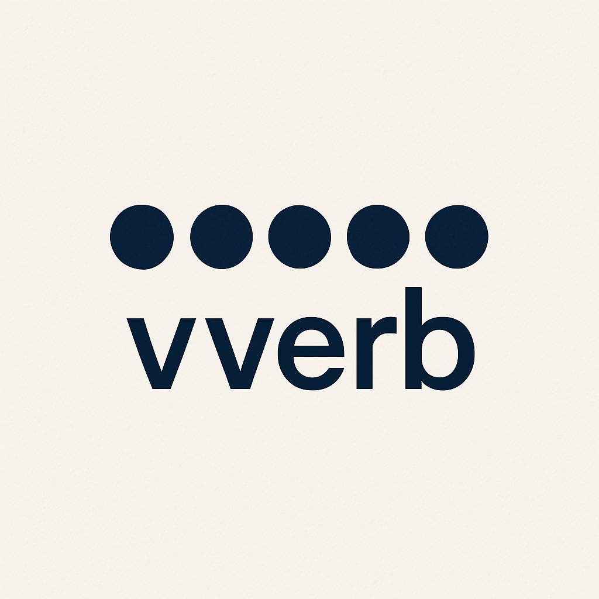

  

---

### 🚀 Initial Adapter Set (v1.0)

| # | Engine         | Notes                                             |
|---|----------------|---------------------------------------------------|
| 1 | **pgvector**   | PostgreSQL extension – easiest local start        |
| 2 | **Qdrant**     | OSS / Rust – hybrid filter, REST + gRPC           |
| 3 | **Milvus 2.x** | OSS / C++ – large-scale, HNSW + IVF + DiskANN     |
| 4 | **Weaviate**   | OSS / SaaS – native BM25 + vector, GraphQL & REST |
| 5 | **Pinecone**   | Fully managed SaaS baseline                       |

---

## About

**vverb** aims to simplify development and prototyping with vector databases.  
It provides a unified, minimal, and Pythonic API for five major engines—so you can build, test, and switch vendors without headaches.

---

## License

This project is licensed under the terms of the [Apache License 2.0](LICENSE).

---

<!-- Optionally add a Getting Started or Install section below -->